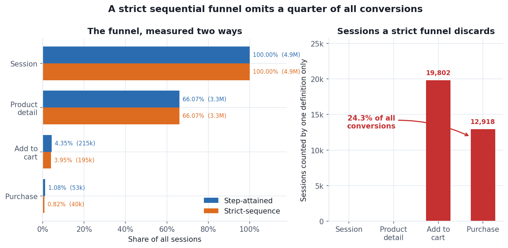
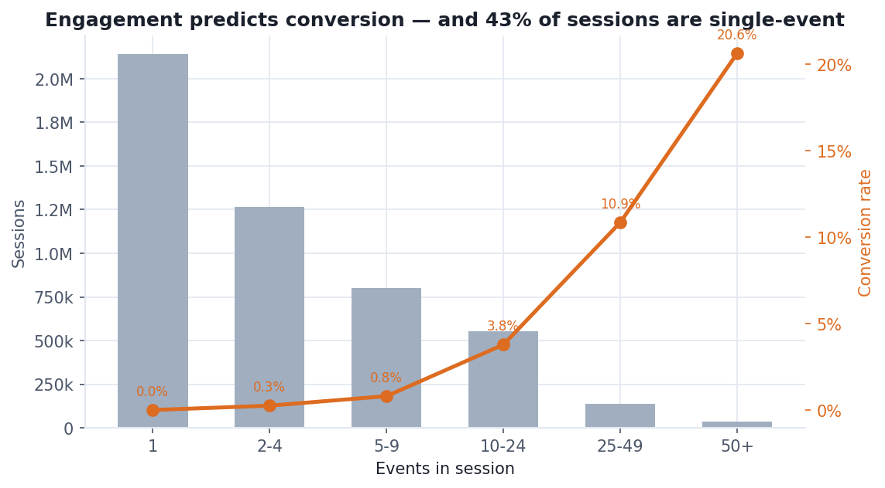
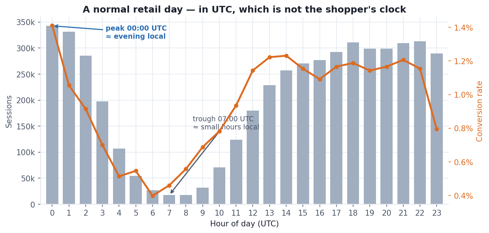

# Customer Journey & Funnel Analysis — Coveo SIGIR 2021 eCommerce Dataset

Generated 2026-08-19 14:27 UTC from 26,369,951 events across 4,934,699 sessions.

> Dataset © Coveo Solutions Inc., released for the SIGIR 2021 eCom Data
> Challenge and used here under their research/educational Terms &
> Conditions. No row-level data is reproduced in this report — only
> aggregate counts and rates.

---

## Findings summary

| | Finding |
|---|---|
| 🔵 | Overall session→purchase conversion 1.08%; strict-sequence definition would report 0.82%, missing 12,918 real conversions. |
| 🟠 | Cart abandonment 78.5% is an upper bound — 7,071 purchases occur in a later session than the add. |
| 🔵 | Zero-result searches show no session-level conversion penalty (3.57% vs 3.56% overall) — see search_analysis.md §4. |

🔴 blocks analysis · 🟠 must be handled in modelling · 🔵 worth knowing

---

## 1. The funnel, both ways

| Stage | Step-attained | % of sessions | Strict-sequence | % of sessions |
|---|---|---|---|---|
| Session started | 4,934,699 | 100.00 | 4,934,699 | 100.00 |
| Product detail view | 3,260,353 | 66.07 | 3,260,353 | 66.07 |
| Add to cart | 214,684 | 4.35 | 194,882 | 3.95 |
| Purchase | 53,209 | 1.08 | 40,291 | 0.82 |

**Step-attained** asks *did the session ever reach this stage?*
**Strict-sequence** asks *did the stages happen in canonical order?*

The two definitions disagree on **12,918 purchasing sessions**
(24.3% of all conversions). Those are real purchases
that a textbook sequential funnel would not count.

Stage-to-stage conversion, on the step-attained definition:

| Transition | Rate |
|---|---|
| Session → product detail | 66.07% |
| Product detail → add to cart | 6.58% |
| Add to cart → purchase | 24.78% |
| **Session → purchase (overall)** | **1.08%** |

2,140,859 sessions (43.4%) consist of a single event
and never enter the funnel at all. They are retained rather than
filtered, because excluding them would inflate every conversion rate
below — a common way funnel dashboards end up disagreeing with revenue.

## 2. Cart abandonment

| Measure | Sessions | Rate |
|---|---|---|
| Sessions that added to cart | 214,684 | — |
| …abandoned (added, never purchased) | 168,546 | **78.51%** |
| …explicitly emptied the cart (removes ≥ adds) | 26,688 | 12.43% |
| Purchases with no add-to-cart in session | 7,071 | — |

Median distinct SKUs added per cart-building session: 1.

Conversion by cart size:

| Cart size | Sessions | Converted | Conversion % |
|---|---|---|---|
| 1 item | 173,262 | 36,902 | 21.30 |
| 2 items | 25,855 | 5,802 | 22.44 |
| 3-5 items | 13,502 | 3,024 | 22.40 |
| 6+ items | 2,065 | 410 | 19.85 |

Abandonment measured this way is an **upper bound**. Some of these
sessions did convert — in a later session, under a different session ID,
where the purchase appears with no preceding add. The
7,071 cross-session purchases are the visible half of that
effect; the abandoning half is counted here. Any abandonment figure from
session-scoped data carries this caveat, and quoting one without it
overstates the problem.

## 3. Session depth and time-to-purchase

| Events in session | Sessions | Conversion % | Median duration (s) |
|---|---|---|---|
| 1 (bounce) | 2,140,859 | 0.00 | 0.00 |
| 2-4 | 1,263,992 | 0.25 | 47.77 |
| 5-9 | 799,682 | 0.80 | 151.01 |
| 10-24 | 555,426 | 3.78 | 415.54 |
| 25-49 | 137,383 | 10.85 | 1,006.32 |
| 50+ | 37,357 | 20.64 | 1,800.00 |

Timing milestones (medians, on the 30-minute-capped duration):

| Milestone | Median |
|---|---|
| Session start → first add to cart | 146 s |
| Session start → purchase | 764 s |
| First add → purchase | 515 s |
| Session duration, all sessions | 23 s |
| Session duration, converting sessions | 927 s |

Medians are used throughout rather than means. The quality assessment
found sessions containing gaps that breach Coveo's own 30-minute rule —
background tabs, clock skew, server-side stitching — and a handful of
multi-hour sessions would drag any mean badly. The capped duration is
reported alongside the raw one in `fct_session` so the adjustment is
visible rather than baked in.

## 4. Does search change the outcome?

| Segment | Sessions | Conversion |
|---|---|---|
| Used search | 474,117 | **3.56%** |
| Did not use search | 4,460,582 | 0.81% |
| Hit ≥1 zero-result search | 145,065 | 3.57% |

Searching sessions convert at 4.4× the rate of
non-searching ones.

**This is a correlation, not a lever.** Shoppers who search are already
further along in intent — searching is a symptom of wanting something
specific, not a cause of buying it. Pushing more shoppers into the
search box would not move the first two rows toward each other.

The third row was intended as the controlled comparison, holding intent
roughly constant by looking only within searching sessions. It returns
**3.57% against 3.56%** — no difference. Whatever a failed
search costs, it is not visible at session grain. That null result is
examined in `search_analysis.md` §4, which sets out why the session is
the wrong unit of analysis for this question.

## 5. Intra-week and intra-day pattern

| Day | Sessions | Conversion % |
|---|---|---|
| Sunday | 738,801 | 1.04 |
| Monday | 726,314 | 1.13 |
| Tuesday | 714,771 | 1.14 |
| Wednesday | 668,644 | 1.09 |
| Thursday | 687,365 | 1.03 |
| Friday | 700,196 | 1.10 |
| Saturday | 698,608 | 1.02 |

| | Hour (UTC) | Sessions | Conversion |
|---|---|---|---|
| Busiest | **00:00** | 342,651 | 1.41% |
| Quietest | **07:00** | 17,593 | 0.46% |
| Highest-converting | **00:00** | 342,651 | 1.41% |

Peak-to-trough traffic ratio: **19.5×**.

### Hours are UTC, and that is a deliberate choice

Timestamps are converted with `epoch_ms()`, which is timezone-independent.
An earlier version used `to_timestamp()`, which resolves in the *session's*
timezone and therefore produced different `hour_of_day` values depending on
which machine ran the pipeline — see `docs/architecture.md` §10.

UTC is reproducible, but it is **not the shopper's local clock**. Coveo do
not disclose the retailer's timezone, so "traffic peaks at
00:00" is not a statement about when people shop.

### What the shape does let you infer

The curve is a textbook retail day: a deep overnight trough at
07:00 UTC, a climb through the working day, and an evening
peak at 00:00 UTC. Anchoring that shape to normal human
behaviour — quietest around 02:00–03:00 local, busiest around
19:00–21:00 local — places the retailer near **UTC-5**, i.e. North
American Eastern time.

That is an inference from the traffic shape, not a disclosed fact, and
nothing downstream depends on it. It is worth stating only because it
shows the UTC hours are behaving sensibly rather than being scrambled by
the conversion — which, given the bug that preceded this, was worth
checking.

Day-of-week and hour-of-day are the only temporal signals used anywhere
in this project. Coveo shifted every timestamp by an undisclosed number
of weeks, so absolute dates carry no meaning, while intra-week and
intra-day structure survive the shift intact.
