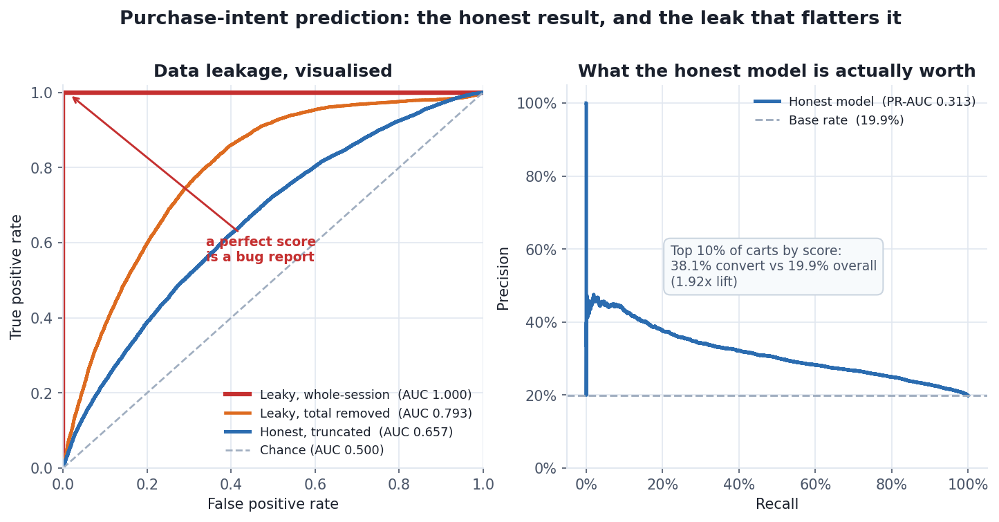

# Purchase-Intent Prediction — Coveo SIGIR 2021 eCommerce Dataset

Generated 2026-08-19 12:05 UTC from 214,684 cart sessions, 46,075 converting (21.46%).

> Dataset © Coveo Solutions Inc., released for the SIGIR 2021 eCom Data
> Challenge and used here under their research/educational Terms &
> Conditions. No row-level data is reproduced in this report — only
> aggregate counts and rates.

---

## Findings summary

| | Finding |
|---|---|
| 🔵 | Base rate 21.5%; best model PR-AUC 0.3134 (1.58x chance), lift@10% 1.92x. |
| 🔴 | Whole-session features give a perfect 1.000 ROC-AUC vs 0.657 honest. The label is reconstructible by subtraction from an accounting identity (n_events = sum of parts), even though n_purchases was excluded. Removing n_events alone drops it to 0.793. |
| 🟠 | Pre-cart behaviour is only weakly predictive; features are aggregates and discard event order. Sequence models are the next step. |

🔴 blocks analysis · 🟠 must be handled in modelling · 🔵 worth knowing

---

## 1. Task and framing

**At the moment a session adds its first item to the cart, will it
purchase?**

This is the cart-abandonment problem, and it is the framing the original
SIGIR challenge used, because it is the one with a decision attached: an
abandoning cart can be intervened on while the shopper is still present.
"Will this session ever purchase?" asked at session start is a harder
question with no corresponding action.

| | |
|---|---|
| Population | 214,684 sessions containing an add-to-cart |
| Positive class | 46,075 that went on to purchase |
| **Base rate** | **21.46%** |
| Train (earliest 80%) | 171,747 |
| Test (latest 20%) | 42,937 |
| Features | 21 numeric + 1 categorical |

**The split is temporal, not random.** Training uses the earliest 80% of
carts and testing the latest 20%. A random split would let the model
learn from sessions occurring after those it is scored on — information
no deployed model could have. Random splitting typically flatters a
temporal problem, and the gap is not always small.

## 2. Results

| Model | ROC-AUC | PR-AUC | PR-AUC / base | Brier | Precision@10% | Lift@10% |
|---|---|---|---|---|---|---|
| Baseline (constant prediction) | 0.5000 | 0.1989 | 1.00x | 0.1596 | 0.210 | 1.06x |
| Logistic regression | 0.6210 | 0.2825 | 1.42x | 0.2358 | 0.336 | 1.69x |
| Gradient boosting | 0.6568 | 0.3134 | 1.58x | 0.1517 | 0.381 | 1.92x |

**A note on which base rate.** The population converts at
21.46%, but the *test period* — the latest 20% of carts — converts
at **19.89%**. Every metric above is computed against the test
base rate, since that is the population the model is scored on.

The gap is not a bug; it is temporal drift, and it is visible only
because the split respects time. A random split would have averaged the
two periods together and hidden it. Cart conversion declined over the
89-day window, which is itself worth knowing: a model trained on early
behaviour is scoring a slightly different world, and that is exactly the
condition a deployed model lives in.

ROC-AUC is reported because it is expected, but **PR-AUC against the
base rate is the number that matters here**. With a 19.9%
positive class, a model can post a respectable-looking ROC-AUC while
being useless at the top of the ranking, which is the only region anyone
acts on.

Best model: **Gradient boosting**, PR-AUC 0.3134 against a
base rate of 0.1989 — **1.58× better than
chance**.

### What this is worth operationally

Targeting the **top 10%** of carts by predicted abandonment risk reaches
a group converting at 38.1% against 19.9%
overall — a **1.92× lift**. For a retention
intervention with a real per-contact cost, that ratio, not the AUC, is
what decides whether the model pays for itself.



## 3. The model is weak, and that is the finding

The honest headline is that pre-cart behaviour predicts conversion
**only modestly**. Comparing feature means across the two classes shows
why — they barely differ:

| Feature | Abandoned | Purchased |
|---|---|---|
| Events before add | 8.33 | 9.61 |
| Product views before add | 3.17 | 3.31 |
| Seconds to first add | 333 | 405 |
| Viewed the SKU before adding it | 88.1% | 84.0% |
| Searches before add | 0.25 | 0.35 |

Note the fourth row runs **backwards** from the intuitive story:
shoppers who viewed the product before adding it convert slightly
*less* often.

Three things follow.

**The signal genuinely is thin.** Whether a cart converts depends
largely on things this dataset cannot see — price comparison on another
site, shipping cost at checkout, payment friction, whether the shopper
was ever buying today. No amount of model tuning recovers information
that was never recorded.

**A stronger result here would be evidence of a bug.** The quality
assessment found 13.3% of purchases occur in a session with no
add-to-cart at all, so a meaningful share of "abandonment" is really
cross-session checkout — noise in the label that no feature can explain.
A model reporting 0.95 AUC on this task would be reason to hunt for
leakage, not to celebrate.

**The sequence is the missing feature.** Every feature here is an
aggregate: counts and durations. What is not encoded is *order* — the
difference between browse→search→view→add and view→add→remove→view→add.
The staging layer already assigns a deterministic `event_seq`, so
sequence models are the natural next step and the one most likely to
actually help.

## 4. Leakage demonstration — removing the outcome column is not enough

Re-running the same task on **whole-session** aggregates from
`fct_session` instead of truncated ones:

| Model | ROC-AUC | PR-AUC | Lift@10% |
|---|---|---|---|
| Honest (truncated at the add) | 0.6568 | 0.3134 | 1.92x |
| **Leaky — with `n_events`** | **0.9998** | **0.9998** | **5.02x** |
| Leaky — `n_events` removed | 0.7930 | 0.4433 | 2.60x |

A **perfect 1.000 ROC-AUC**. And the interesting part is
*how*.

### The leak is not in any single feature

That feature set was built carefully. It deliberately excludes every
obvious giveaway — no `n_purchases`, no `sec_to_purchase`, no
`reached_purchase`, no `cart_abandoned`. Inspected one column at a time,
nothing in it looks like the answer. It is exactly the review most
feature sets actually get.

It leaks anyway, because `fct_session` satisfies an **accounting
identity**:

```
n_events = n_pageviews + n_product_views + n_adds + n_removes + n_purchases
```

verified to hold for **214,684 of 214,684** cart
sessions — all of them. So the excluded column is recoverable by
subtraction:

```
n_purchases = n_events - n_pageviews - n_product_views - n_adds - n_removes
```

and `n_purchases > 0` *is* the label. A linear model finds this
immediately: it is one linear combination away, which is precisely the
function class logistic regression searches. Dropping the outcome column
accomplished nothing, because the outcome was still spanned by the
remaining features.

### Confirming the diagnosis

Removing only `n_events` — the total that closes the identity — drops
ROC-AUC from **0.9998 to 0.7930**.
One column, and the perfect separation collapses. That is the diagnosis
confirmed rather than assumed.

The residual leak at 0.7930 is the ordinary kind:
a purchasing session is longer and busier *because* it purchased, so
`duration_sec` and the counts are measurements taken after the outcome
they are used to predict. Still leakage — just no longer perfect.

### The transferable lesson

Checking features one at a time is not sufficient. **Any group of
columns that sums to a total can reconstruct an excluded member**, and
counts that partition a total are everywhere in analytics tables — they
are what a well-designed fact table looks like. The check that catches
this is asking whether the target is *reconstructible* from the feature
set, not whether it is *present* in it.

Reproducing this deliberately costs a few seconds. Discovering it after
a model ships, underperforms, and nobody can say why is considerably
more expensive.
