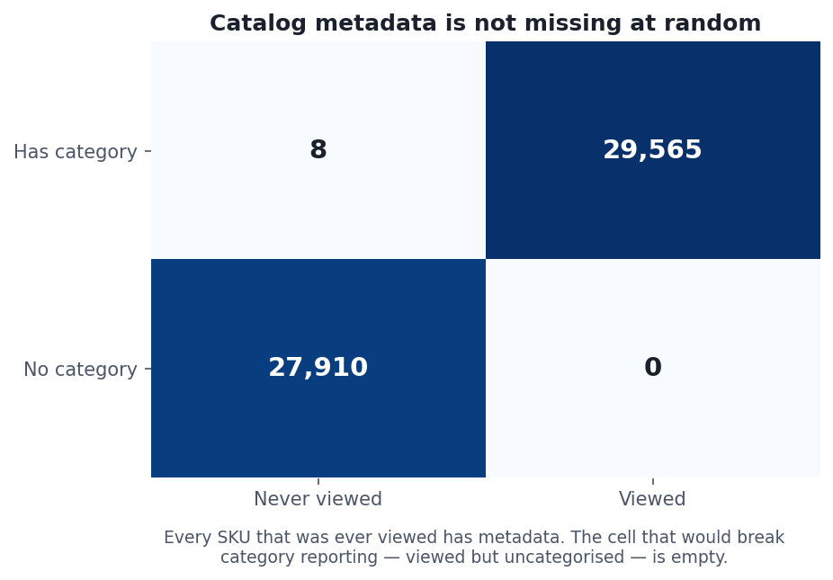
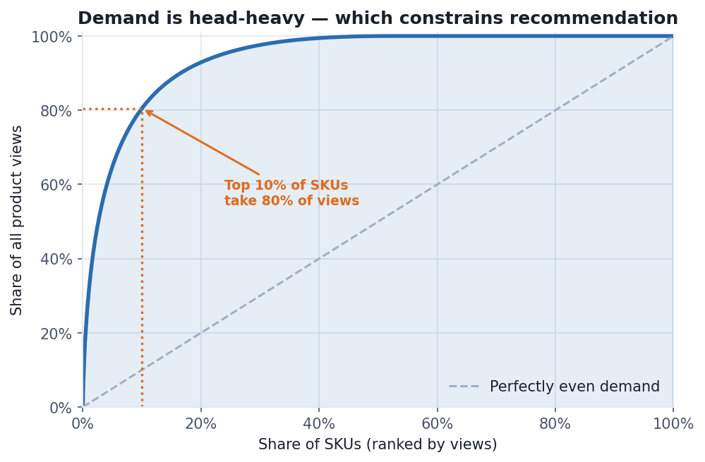

# Product & Commercial Analytics — Coveo SIGIR 2021 eCommerce Dataset

Generated 2026-08-19 14:25 UTC from 7,121,576 product views across 57,483 SKUs.

> Dataset © Coveo Solutions Inc., released for the SIGIR 2021 eCom Data
> Challenge and used here under their research/educational Terms &
> Conditions. No row-level data is reproduced in this report — only
> aggregate counts and rates.

---

## Findings summary

| | Finding |
|---|---|
| 🔴 | Catalog metadata is NOT missing at random: all 29,565 ever-viewed SKUs have it, while uncatalogued SKUs are almost purely cart removals/purchases from cross-session carts. |
| 🟠 | 10.1% of purchases are on SKUs with no price bucket — revenue-by-price breakdowns omit them. |
| 🟠 | Price view→purchase 2.26% (buckets 1-3) vs 0.65% (8-10), but price is confounded with category — not a clean price effect. |
| 🔵 | Top 10% of SKUs take 80% of product views — head-heavy demand means Layer 5 recommenders need coverage/novelty metrics, not just hit-rate. |

🔴 blocks analysis · 🟠 must be handled in modelling · 🔵 worth knowing

---

## 1. Catalog coverage is not missing at random

Before any category or price breakdown, the honest first question is how
much of the business those breakdowns can see.

| Measure | SKUs | Coverage |
|---|---|---|
| Distinct SKUs with any browsing activity | 57,483 | 100% |
| …present in the catalog file | 57,483 | 100.00% |
| …with a category | 29,573 | 51.45% |
| …with a price bucket | 29,559 | 51.42% |

Roughly half the SKUs lack metadata — which sounds like it should
cripple every breakdown below. Weighting by traffic instead of SKU
count tells a completely different story:

| Measure | Covered | Share of total |
|---|---|---|
| Product views on categorised SKUs | 7,121,576 | **100.00%** |
| Product views on priced SKUs | 7,120,602 | 99.99% |
| Purchases on priced SKUs | 66,876 | **89.90%** |

### The missingness has a structure

Crossing "has a category" against "was ever viewed" shows the two are
almost the same variable:

| | Never viewed | Viewed |
|---|---|---|
| **No category** | 27,910 | 0 |
| **Has category** | 8 | 29,565 |

**Every SKU that was ever viewed has catalog metadata.** The cell that
would break every category report — viewed but uncategorised — contains
0 SKUs.

What the metadata-less SKUs actually do:

| Group | SKUs | Adds | Purchases | Removes |
|---|---|---|---|---|
| Never viewed | 27,918 | 6 | 7,464 | 86,794 |
| Viewed | 29,565 | 288,297 | 66,927 | 300 |

They are almost entirely **cart removals and purchases with no
corresponding view** — the exact signature of the cross-session carts
found in the quality assessment. These are products whose detail page
was viewed in an earlier session; only the later checkout or removal
falls inside the window, and the catalog export evidently covers the
actively-merchandised range rather than everything a cart might contain.

### Why this matters for the rest of the report

- **View-based breakdowns (§2, §3) are effectively complete** at
  100.0% coverage. The 51% figure is not the
  relevant one.
- **Purchase-based breakdowns are not.** 10.1%
  of purchases occur on SKUs with no price bucket, so any
  revenue-by-price statement silently omits a tenth of conversions.
- **Cart-removal analysis is largely blind**, since removals concentrate
  almost entirely in the uncatalogued group.

None of this would be visible had uncatalogued SKUs been dropped instead
of modelled as `(unknown)` members — both tables would simply have read
100% and the structure would be invisible.

## 2. Category performance

| Category | SKUs | Views | Adds | Purchases | View→Add % | View→Purchase % |
|---|---|---|---|---|---|---|
| Category A | 15,958 | 3,270,198 | 137,517 | 35,597 | 4.21 | 1.09 |
| Category B | 10,138 | 1,919,321 | 70,531 | 12,963 | 3.67 | 0.68 |
| Category C | 2,673 | 1,876,147 | 77,374 | 17,634 | 4.12 | 0.94 |
| Category D | 557 | 34,510 | 1,507 | 362 | 4.37 | 1.05 |
| Category E | 195 | 18,930 | 1,021 | 294 | 5.39 | 1.55 |
| Category F | 36 | 1,281 | 88 | 23 | 6.87 | 1.80 |
| Category G | 15 | 1,099 | 264 | 57 | 24.02 | 5.19 |
| Category H | 1 | 90 | 1 | 1 | 1.11 | 1.11 |

Categories are shown under stable pseudonyms assigned by descending
traffic. The underlying identifiers are 64-character hashes and are
dataset content, so they are not reproduced here — see the module
docstring for the reasoning.

The spread in view→purchase rate across categories is the commercially
interesting quantity: it separates categories where browsing converts
from categories that attract traffic and do not. Note that with hashed
categories there is no way to tell whether a low-converting category is
a merchandising failure or simply a browse-heavy category like
accessories, where low conversion is normal. Anonymisation buys privacy
at the cost of exactly the domain context that would make this
actionable — worth stating rather than glossing over.

## 3. Price sensitivity

`price_bucket` is a **10-quantile bucket**, not a currency amount. Each
bucket holds roughly a tenth of the catalog by price rank, so the only
valid statements are ordinal ones: bucket 8 is pricier than bucket 4.
"Bucket 8 costs twice bucket 4" is not something this data supports.

| Price bucket | SKUs | Views | Adds | Purchases | View→Add % | View→Purchase % |
|---|---|---|---|---|---|---|
| 1 | 2,974 | 112,935 | 14,688 | 4,172 | 13.01 | 3.69 |
| 2 | 2,925 | 137,656 | 14,583 | 2,644 | 10.59 | 1.92 |
| 3 | 3,042 | 194,375 | 16,355 | 3,256 | 8.41 | 1.68 |
| 4 | 3,058 | 304,656 | 22,007 | 4,381 | 7.22 | 1.44 |
| 5 | 2,881 | 444,542 | 26,786 | 5,480 | 6.03 | 1.23 |
| 6 | 2,764 | 624,140 | 33,020 | 8,210 | 5.29 | 1.32 |
| 7 | 2,888 | 831,846 | 37,123 | 9,770 | 4.46 | 1.17 |
| 8 | 2,954 | 1,364,716 | 49,811 | 13,782 | 3.65 | 1.01 |
| 9 | 3,009 | 1,311,461 | 37,866 | 9,237 | 2.89 | 0.70 |
| 10 | 3,064 | 1,794,275 | 35,810 | 5,944 | 2.00 | 0.33 |

Cheapest three buckets convert at **2.26%** view→purchase;
priciest three at **0.65%**.

Two warnings before reading a price effect into this. Price bucket is
confounded with category — expensive categories differ from cheap ones
in far more than price, so this comparison is not holding product type
constant. And the ~52% of SKUs with no price bucket are excluded
entirely from this table; if missing metadata correlates with anything
commercially relevant, that absence is itself a selection effect.

A defensible price analysis would compare buckets *within* a category
rather than across the whole catalog. That is a natural extension of
this table and is not claimed by it.

## 4. How concentrated is demand?

| Measure | SKUs | Share |
|---|---|---|
| SKUs with browsing activity | 57,483 | 100% |
| …viewed but never added to a cart | 8,476 | 14.75% |
| …purchased at least once | 13,290 | 23.12% |

Median product views per SKU: 2.

Traffic concentration:

| Top N% of SKUs by views | Share of all product views |
|---|---|
| Top 1% | 31.1% |
| Top 10% | 80.5% |
| Top 20% | 92.9% |

This is the classic long tail, and it constrains the recommendation work
in Layer 5 directly. With demand this concentrated, a recommender that
optimises raw hit-rate will learn to suggest head products to everyone —
scoring well on paper while adding nothing a shopper could not have
found unaided. Coverage and novelty metrics have to sit alongside
accuracy, and that decision follows from this table rather than from
preference.
